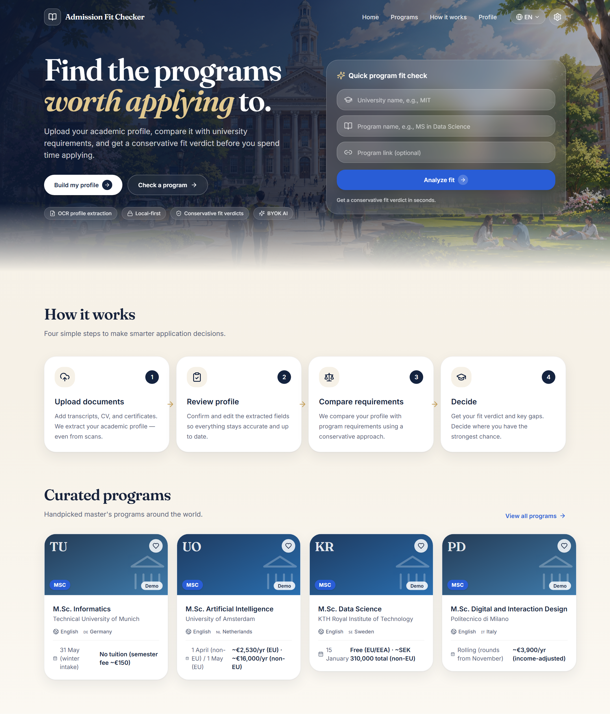
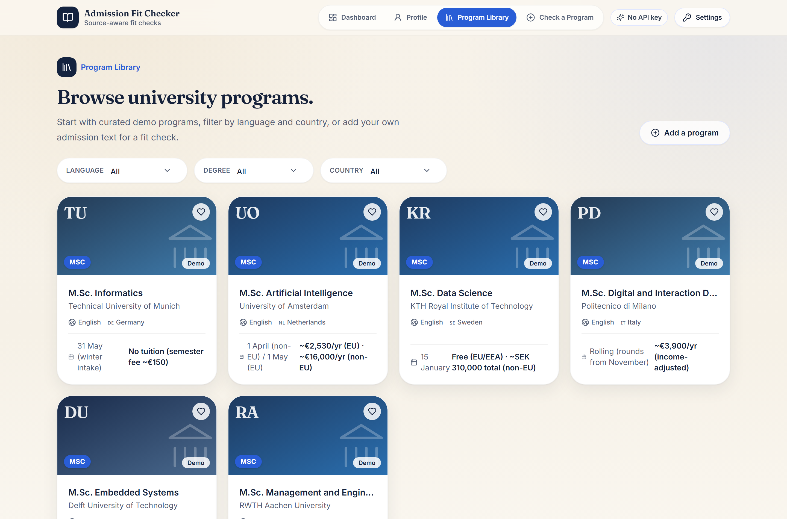
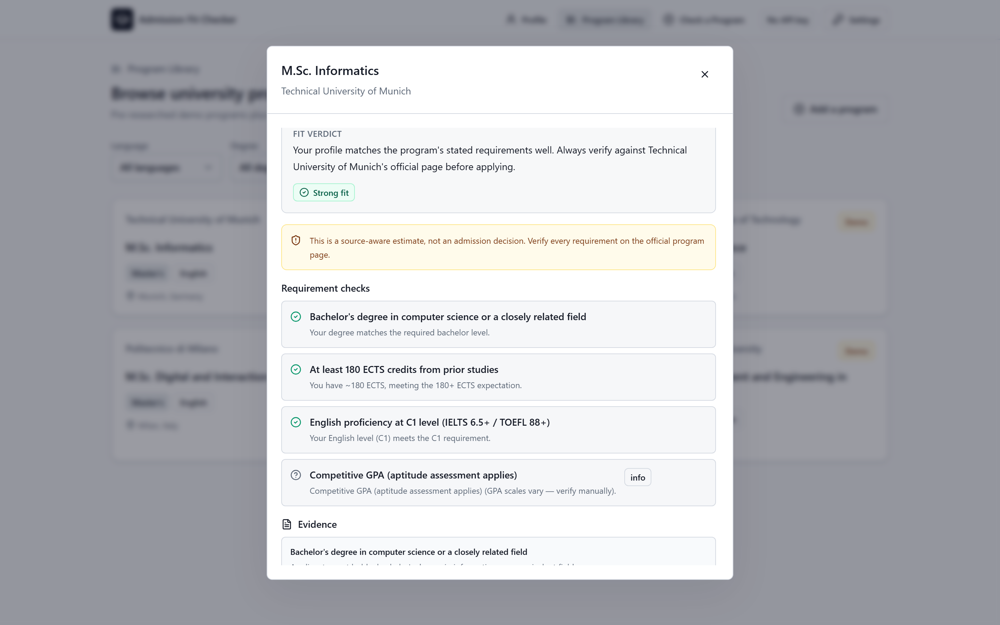

# Admission Fit Checker

A local-first, AI-assisted tool that extracts an academic profile and compares it with university program requirements using **conservative, source-aware fit analysis**.

Instead of guessing, it tells you *why* you fit — and when there isn't enough data to decide, it says so.

**[▶ Live Demo](https://admission-fit-checker.vercel.app/)** · [Tech Stack](#tech-stack) · [What I Designed](#what-i-designed)

<p>
  
  
  
  
  
</p>

---

## Overview

Applicants comparing international programs face scattered requirements and vague "am I qualified?" answers. Admission Fit Checker turns an uploaded transcript or CV into a structured academic profile, models each program's requirements as data, and runs a transparent fit check that returns one of four honest verdicts — with the evidence behind each decision.

Everything runs in the browser. No backend, no login, no server database.

## Screenshots

> 📸 **TODO:** capture and add the images below to `docs/assets/`. The section is wired up and ready.

| Dashboard | Program Library | Fit Result |
| :---: | :---: | :---: |
|  |  |  |

## Fit verdicts

| Verdict | Meaning |
| --- | --- |
| 🟢 **Strong fit** | Profile matches the stated requirements well. |
| 🟡 **Possible but risky** | May qualify, but some requirements are weak or unclear. |
| 🔴 **Not recommended** | One or more core requirements do not appear to be met. |
| ⚪ **Not enough data** | Not enough profile or program data to judge fit yet. |

## What I Designed

- **Academic profile extraction workflow** — upload a transcript, diploma, CV, or language certificate (PDF), parse it client-side, and auto-fill structured fields.
- **Program requirement modeling** — each program's admission rules are stored as typed, structured requirements (degree, field, ECTS, language level, documents), each backed by source text.
- **Conservative fit scoring** — decisive checks (degree, field, ECTS, language) drive the verdict; informational checks (GPA, documents) never inflate it.
- **Human review before profile save** — extracted fields are always editable and are only persisted when the user confirms.
- **Separation between user documents and program requirements** — personal document text and program data are modeled and stored independently.
- **BYOK AI flow** — users bring their own OpenAI-compatible key; the app degrades gracefully to local heuristics when none is set.
- **Local-first privacy model** — profile, documents, and settings live in the browser (IndexedDB + localStorage).
- **"Not enough data" behavior** — the app refuses to fabricate a decision when evidence is missing.

## Tech Stack

| Area | Choice |
| --- | --- |
| Build tool | **Vite** |
| UI | **React** + **TypeScript** |
| Styling | **Tailwind CSS** |
| Local storage | **IndexedDB** via **Dexie** |
| PDF parsing | **pdfjs-dist** (client-side) |
| Validation | **Zod** |
| AI | **BYOK** OpenAI-compatible providers (OpenAI, Gemini OpenAI-compatible endpoint) |
| Hosting | **Vercel** |

## AI Safety / Hallucination Control

The AI layer is deliberately constrained so the product stays trustworthy:

- **No admission guarantees.** The tool never claims you will be accepted — it estimates fit against *stated* requirements.
- **AI extracts and summarizes only.** It reads document text into structured fields and answers questions strictly from a single program's own information. It does not invent requirements, deadlines, or fees.
- **The fit verdict is conservative.** Scoring favors caution: unclear or unmet decisive requirements pull the verdict down rather than up.
- **Uncertain requirements become risks or `not_enough_data`.** Missing evidence is surfaced explicitly instead of being filled with assumptions.
- **The user reviews the profile before analysis.** Extracted data is human-verified before it feeds any fit check.

## Run Locally

```bash
npm install
npm run dev
```

Build:

```bash
npm run build
```

## Privacy

Your profile, document text, and BYOK settings stay in the browser. If AI is enabled, document/profile text and program text may be sent to your selected provider **only** when you run extraction or ask a question. Avoid sensitive documents on shared devices.

## Future Improvements

- OCR for scanned PDFs and screenshots
- Smarter requirement parsing from pasted admission text
- Country-aware grade/GPA normalization
- Exportable fit reports
- A larger, curated program catalog

---

<sub>Demo programs are illustrative placeholders. Always verify requirements against each university's official admissions page. This project is a decision-support demo, not official admission advice.</sub>
